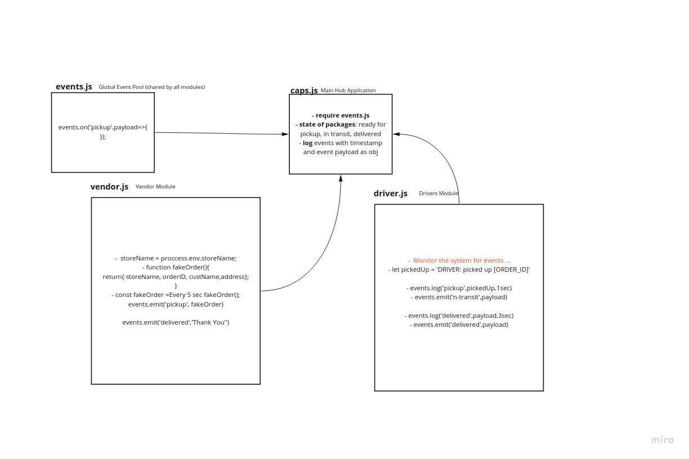

# caps# caps
**Test**
- [x] Pickup log
- [x] In-transit log
- [x] Delivered log

## Installation

1. open your terminal

2. Clone the repo

`https://github.com/ahmadkheder-401-advanced-javascript/caps/tree/events`
## Usage

## Architecture

This application was build with Node.js and it includes:
- jest: test package
- faker: fake data generator

# UML diagram

